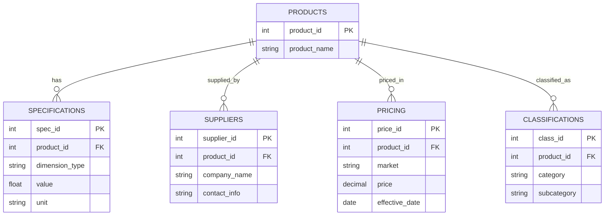

export const metadata = {
  title: 'Two Definitions of Quality',
  alternates: {
    canonical: '/writings/two-definitions-of-quality',
  },
};

# Two Definitions of Quality

 

The word **quality** has two distinct but interconnected meanings that shape how we perceive and evaluate the world.

## The Two Meanings

**Definition 1: Quality as characteristic** refers to any distinguishing feature we can perceive in objects, forces, or relationships. A red apple has the quality of redness; a symphony might be in B-flat major; a government may show transparency. These characteristics often fall into one or more of the following overlapping categories:

- **Quantifiable qualities** — those we can measure (e.g., length, temperature, frequency)
- **Categorical qualities** — those we use to classify or identify (e.g., shape, species, political structure)
- **Relational qualities** — those that depend on context, connection, or interaction (e.g., balance, harmony, contrast)

**Definition 2: Quality as excellence** refers to degrees of goodness, beauty, or value. When we say something has "high quality," we mean it excels in some way that matters. A well-crafted chair, a powerful piece of music, or an effective policy all express quality in this evaluative sense.

## The Connection Between Perception and Evaluation

These two meanings are more than a quirk of language — they reflect a deep pattern in human experience. We can't evaluate what we haven't distinguished, and we rarely distinguish without also beginning to evaluate.

Consider two wooden chairs. We first notice their distinguishing features: one has smooth surfaces and balanced proportions, while the other feels rough and wobbles. These are qualities in the *characteristic* sense. But soon, we judge the smooth, balanced chair as *better*. The shift from *what it's like* to *how good it is* happens so naturally that it reveals how perception and evaluation are closely linked.

This link has philosophical implications. As John Locke observed, we never perceive objects directly — only their qualities. What we call a "chair" is our mental construction of features like hardness, shape, and the capacity to support sitting. The object itself is not separate from these qualities, but emerges from them.

## A Modern Illustration: Database Design

Modern database architecture offers a concrete example of how objects can be understood as structured bundles of qualities. In well-designed databases, a main table — like "Products" — might contain only an identifier, while most descriptive information is stored in related tables linked through foreign keys:

- A *specifications* table records dimensions and materials  
- A *suppliers* table tracks who made the product  
- A *pricing* table stores cost data for different markets  
- A *classifications* table organizes products by type and function  

Even names can be kept in reference tables, making them easier to translate, update, or reuse.

For example, a laptop product in such a system isn't defined by a single field. Its identity emerges from a network of features:

- **Specifications**: 15.6" screen, 16GB RAM, 512GB SSD  
- **Supplier**: TechCorp, 2024 model  
- **Pricing**: $899 wholesale  
- **Classifications**: electronics category, portable device type, business use  

This isn't just a technical strategy — it mirrors something deeper about identity. A "product" exists not as a standalone entity, but as the intersection of various qualities. Remove the relationships, and the object dissolves into fragments: dimensions without context, prices without things, classifications without subjects. Identity comes from the *pattern of connections* among qualities, not from some essential core.

This architectural model reflects how we understand most things — as assemblies of qualities held together by structure and context.

It's important to note that an object's identity is not tied to a *fixed* set of qualities. As Descartes observed in his example of melting wax, all perceptible features may change — shape, smell, texture, even sound — and yet we still recognize it as the *same* wax. What remains is not a fixed list of qualities, but a coherent transformation within a pattern we continue to recognize. This suggests that identity depends not only on *which* qualities are present, but also on *how* they relate, persist, and evolve together over time.

## Implications

Seeing quality in both its perceptual and evaluative dimensions helps explain why human cognition moves so easily from noticing to judging. We are not passive recorders of sensory input but active evaluators, always asking what something means, whether it matters, and how well it works. This dual aspect of quality blurs the line between objective description and subjective assessment.

Interestingly, the dual meaning of *quality* appears in several unrelated languages. In Russian, *kachestvo* carries both senses. So does *jawda* in Arabic. While not universal, this linguistic pattern suggests that the connection between perception and evaluation may be more than a quirk of English — it may reflect a shared structure of thought.

This foundational perspective sets the stage for understanding how quality informs everything from perception and language to science, education, and design.

Understanding both senses of quality — as characteristic and as excellence — gives us a clearer lens for observing the substance and dynamics of the world around us.
